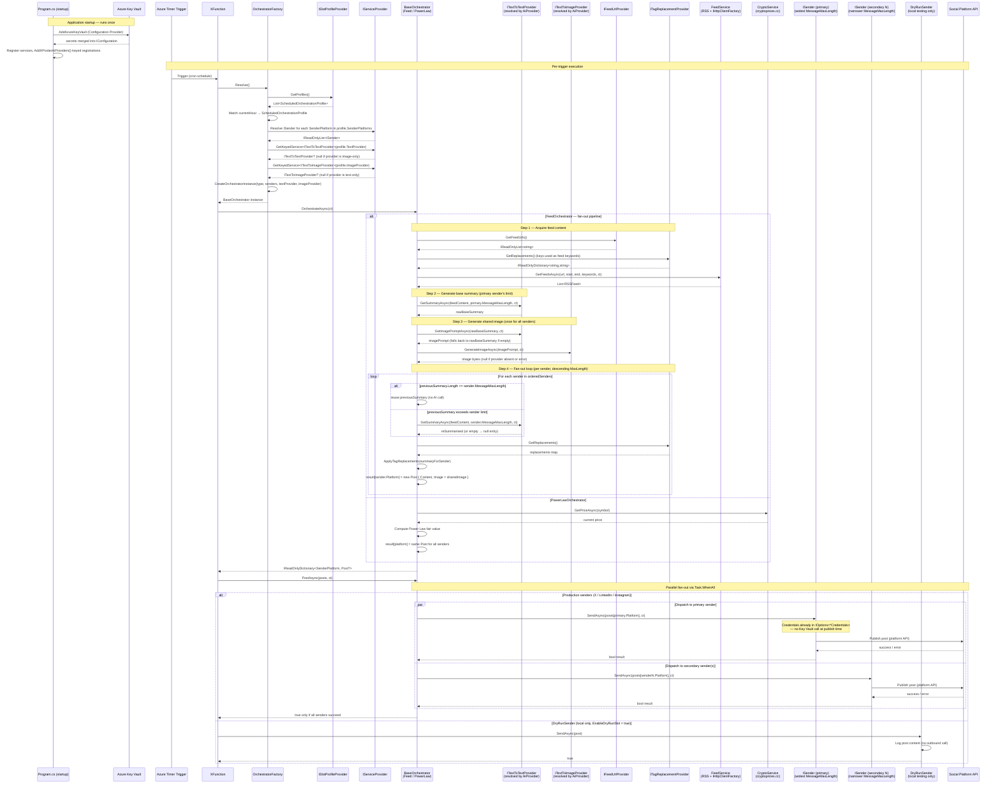

# Architecture

This document explains the architectural decisions, component responsibilities, and extension contracts of **XPoster** — an AI-powered social media automation platform built on Azure Functions.

> See also: [README.md](../README.md) for setup, configuration, and deployment instructions.

---

## Table of Contents

1. [System Overview](#1-system-overview)
2. [Component Responsibilities](#2-component-responsibilities)
3. [Design Patterns Used](#3-design-patterns-used)
4. [Architecture Decision Records (ADRs)](#4-architecture-decision-records-adrs)
5. [Extension Points](#5-extension-points)
6. [Data Flow Diagram](#6-data-flow-diagram)

---

## 1. System Overview

XPoster is a **serverless, event-driven pipeline** that runs on a timer, selects a content strategy based on the current time, generates a social media post (optionally using AI), and publishes it to one or more platforms via pluggable sender components.

```
┌────────────────────────────┐
│   Azure Timer Trigger      │
│   (configurable schedule)  │
└───────────┬────────────────┘
            │
            ▼
┌────────────────────────────┐
│   OrchestratorFactory      │ ◄─── Strategy Pattern
│   (ISlotProfileProvider)   │ ◄─── Injected schedule profiles
└───────────┬────────────────┘
            │
    ┌───────┴────────┬──────────────┐
    ▼                ▼              ▼
┌──────────────┐   ┌──────────────┐   ┌──────────────┐
│     Feed     │   │  PowerLaw    │   │      No      │
│ Orchestrator │   │ Orchestrator │   │ Orchestrator │
└─────┬────────┘   └─────┬────────┘   └──────────────┘
      │                  │
      └──────┬───────────┘
             │
             ▼ IReadOnlyDictionary<SenderPlatform, Post?>
    ┌────────────────────┐
    │   Services         │
    ├────────────────────┤
    │ • AiServiceHelper  │ ◄─── HTTP response parsing / 429 handling
    │ • Feed Service     │ ◄─── RSS Parser (IHttpClientFactory + Polly)
    │ • Crypto Service   │ ◄─── CryptoPrices HTTP client
    │ • FeedUrlProvider  │ ◄─── Feed URL resolution (IFeedUrlProvider)
    │ • TagReplacement   │ ◄─── Hashtag map resolution (ITagReplacementProvider)
    └────────┬───────────┘
             │
             ▼ Task.WhenAll (parallel fan-out)
    ┌────────────────────┐
    │ Sender Plugins     │
    ├────────────────────┤
    │ • XSender          │ ◄─── Twitter/X API
    │ • InSender         │ ◄─── LinkedIn API
    │ • IgSender         │ ◄─── Instagram API
    │ • DryRunSender     │ ◄─── Local testing only (no outbound API calls)
    └────────────────────┘
```

**Key Vault credentials** are loaded into `IConfiguration` at application startup via the Azure Key Vault Configuration Provider (`AddAzureKeyVault` in `Program.cs`). Senders receive their credentials through standard `IOptions` binding — no Key Vault calls occur at post-publish time.

**System boundaries:**
- **Inbound**: Azure Timer Trigger (no external HTTP surface in production)
- **Outbound**: Configured AI provider API, Twitter/X API, LinkedIn API, Instagram Graph API, RSS feeds, Azure Key Vault (startup only)
- **Observability**: Azure Application Insights

---

## 2. Component Responsibilities

### XFunction — Entry Point

`XFunction` is the Azure Functions timer-triggered entry point. Its sole responsibility is to **drive the pipeline**: call `Resolve()` on the factory to obtain the correct orchestrator for the current time slot, invoke `OrchestrateAsync()`, and forward the resulting dictionary of posts to `PostAsync()` for parallel fan-out dispatch. It owns no business logic and depends exclusively on injected abstractions, keeping the trigger layer thin and testable.

### OrchestratorFactory — Strategy Selector

`OrchestratorFactory` maps the current hour of day to a `ScheduledOrchestrationProfile` supplied by an injected `ISlotProfileProvider`. Each profile carries five fields:

| Field | Type | Purpose |
|---|---|---|
| `Hour` | `int` | Hour of day (0–23) when this slot is active |
| `SenderPlatforms` | `IReadOnlyList<SenderPlatform>` | List of target platforms for this slot. Declaration order does not affect execution: `FeedOrchestrator` re-orders senders internally by descending `MessageMaxLength`; the widest sender drives base summary generation |
| `OrchestratorType` | `Type` | The concrete `BaseOrchestrator` subclass to instantiate |
| `TextProvider` | `AiProvider?` | Optional AI provider for text generation |
| `ImageProvider` | `AiProvider?` | Optional AI provider for image generation; may differ from `TextProvider` |

At runtime, the factory calls `Resolve()` to match the current hour to a profile, independently resolves all **senders** (via the DI container, keyed by each `SenderPlatform` in `SenderPlatforms`) and the **AI capability services** (via `IServiceProvider.GetKeyedService<ITextToTextProvider>` and `GetKeyedService<ITextToImageProvider>` keyed by `profile.TextProvider`/`profile.ImageProvider`), then dynamically constructs the orchestrator using reflection (`CreateOrchestratorInstance`). The effective `AiProvider` can be overridden at deploy time via the `AiProvider` configuration key, without code changes.

Both capability services are **optional**: not every `AiProvider` implements both interfaces. `GetKeyedService` returns `null` when the requested capability is not registered for the given key — this is intentional and surfaces explicitly at the point of use inside `FeedOrchestrator`, not silently.

The **schedule itself is a dependency**, not a compile-time constant. In production, `DefaultSlotProfileProvider` supplies the canonical slots. For local dry-run testing, `DryRunSlotProfileProvider` decorates `DefaultSlotProfileProvider` and appends the dry-run slot at hour 9; it is activated by setting `EnableDryRunSlot = true` in app settings and registered in `Program.cs` via conditional DI. This means adding or switching the dry-run slot requires no changes to `OrchestratorFactory`.

The factory enforces the invariant that every unscheduled hour resolves to `NoOrchestrator`, so `XFunction` never receives a null orchestrator.

### Orchestrators — Content Strategies

Each orchestrator extends `BaseOrchestrator` and encapsulates a specific **content production algorithm**. `OrchestrateAsync()` returns an `IReadOnlyDictionary<SenderPlatform, Post?>` — one entry per configured sender, keyed by `SenderPlatform` for unambiguous nominal routing. A `null` value for a given key signals that content generation failed for that platform.

- **FeedOrchestrator**: executes a fan-out pipeline to produce per-sender posts from RSS news:
  1. **Acquire feed content** — resolves URLs via `IFeedUrlProvider`, fetches RSS entries via `FeedService`, aggregates content from the last 24 hours.
  2. **Generate base summary** — re-orders senders by descending `MessageMaxLength`, selects the primary sender (index 0, widest limit), and calls `ITextToTextProvider.GetSummaryAsync(feedContent, primary.MessageMaxLength)`. This produces `rawBaseSummary` — the widest possible summary, used as the source for image prompt derivation.
  3. **Generate image** — calls `ITextToTextProvider.GetImagePromptAsync(rawBaseSummary)` (falls back to `rawBaseSummary` if empty), then `ITextToImageProvider.GenerateImageAsync(prompt)`. The resulting `byte[]?` is **shared across all senders** — generated once, referenced by every `Post`.
  4. **Build per-sender posts (fan-out loop)** — iterates over all senders in descending `MessageMaxLength` order. For each sender, checks whether `previousSummary` (initially `rawBaseSummary`) fits within `sender.MessageMaxLength`. If it fits, `previousSummary` is reused directly. If it does not, the AI re-summarises from the **full `feedContent`** (not from `previousSummary`) to preserve maximum context; the result becomes the new `previousSummary`. Hashtag substitution (`ApplyTagReplacements`) is applied independently to each sender's final raw summary.
  5. **Partial failure semantics** — if re-summarisation returns empty for a sender, a `null` entry is stored in the result dictionary for that platform and iteration continues. The primary summary failure (step 2) is fatal: the dictionary is returned empty.

  Both `IFeedUrlProvider` and `ITagReplacementProvider` follow the same provider pattern: registered as `Singleton`, bound from app settings, swappable via DI without touching orchestrator logic. If `IFeedUrlProvider` returns an empty list, `OrchestrateAsync()` returns an empty dictionary immediately with no AI or sender invocation. Both AI capability providers are injected as nullable — `FeedOrchestrator` handles `null` text or image providers explicitly at the point of use.

- **PowerLawOrchestrator**: constructs posts based on the Bitcoin Power Law model (`value = 10⁻¹⁷ × days^5.83`, where `days` is elapsed since the Bitcoin genesis block on 2009-01-03). It consumes `CryptoService` to fetch the live BTC price and compares it against the model's fair-value estimate. The same `Post` is broadcast to all senders unchanged. It has no dependency on AI providers.
- **NoOrchestrator**: a null-object implementation that returns an empty dictionary immediately, allowing the factory to represent "no posting" without null-checks in `XFunction`.

### BaseOrchestrator — Shared Scaffolding

`BaseOrchestrator` provides the shared infrastructure for all concrete orchestrators:

- **`_senders`** (`IReadOnlyList<ISender>`): the list of senders configured for this slot, as re-ordered by `FeedOrchestrator` in descending `MessageMaxLength` order at runtime. The first entry after re-ordering is the **primary sender** (widest limit).
- **`_sender`** (`ISender?`): computed property returning `_senders[0]` (primary sender) or `null` when the list is empty. Concrete orchestrators use this as the reference for base content generation.
- **`PostAsync(IReadOnlyDictionary<SenderPlatform, Post?> posts)`**: dispatches each post to the sender whose `ISender.Platform` matches the dictionary key, in parallel via `Task.WhenAll`. A `null` post causes that sender to be skipped with a warning. A sender whose platform has no entry in the dictionary is also skipped with a warning. Returns `true` only if all dispatched senders succeed.
- **`DispatchAsync`** (private): guards against null/empty content, logs the per-sender outcome (`"Sender {Sender} result: {Result}"`), and delegates to `ISender.SendAsync(post, ct)`.

### Services Layer — Shared Infrastructure

Services are registered as singletons or transients in the DI container and are consumed by orchestrators and sender plugins:

- **AiServiceHelper**: a shared utility class used internally by AI service implementations. It encapsulates HTTP response parsing logic and rate-limit (HTTP 429) handling, keeping individual service classes focused on their provider-specific contracts.
- **FeedService**: RSS parser with in-memory caching (24-hour TTL) and keyword/date filtering. Uses the named `"Feed"` `HttpClient` created via `IHttpClientFactory`, backed by a Polly standard resilience pipeline (retry, circuit breaker, attempt timeout). This aligns `FeedService` with all other HTTP-consuming services in the codebase and eliminates the per-invocation socket allocation that `new HttpClient()` would cause on Azure Functions.
- **ConfigurationFeedUrlProvider** (`IFeedUrlProvider`): resolves the list of RSS feed URLs consumed by `FeedOrchestrator` from the `FeedOptions` configuration section (bound via `FeedOptions__Urls__N` double-underscore notation). Registered as `Singleton`. To load URLs from a different source (database, Key Vault, remote config), implement `IFeedUrlProvider` and register the new implementation in `Program.cs` in place of `ConfigurationFeedUrlProvider`.
- **ConfigurationTagReplacementProvider** (`ITagReplacementProvider`): resolves the word-to-hashtag replacement map consumed by `FeedOrchestrator` from the `TagReplacementOptions:Replacements` configuration section (bound via `TagReplacementOptions__Replacements__<word>` double-underscore notation). Registered as `Singleton`. Matching is case-insensitive; only the first occurrence of each word per post is replaced. An empty or absent section is valid — the summary passes through unchanged. To source replacements from a different store (database, remote config), implement `ITagReplacementProvider` and swap the registration in `Program.cs`.
- **CryptoService**: thin HTTP client that polls `cryptoprices.cc` to retrieve the current market price for a given cryptocurrency symbol. Returns `0` on failure to allow graceful degradation in orchestrators.

**AI Provider Services** — registered as **keyed services** by `AiProvider` via `AddXPosterAiProviders()` in `Program.cs`:

| `AiProvider` key | Concrete service | `ITextToTextProvider` | `ITextToImageProvider` |
|---|---|---|---|
| `OpenAi` | `OpenAiService` | ✅ | ✅ |
| `AzureFoundry` | `AzureFoundryService` | ✅ | ✅ |
| `DeepSeek` | `DeepSeekService` | ✅ | ❌ — `GenerateImageAsync` throws `NotSupportedException` |
| `Perplexity` | `PerplexityService` | ✅ | ❌ — method removed; misconfiguration surfaces at point of use |
| `FalAi` | `FalAiImageService` | ❌ | ✅ |

Providers that do not implement a capability have no keyed registration for the missing interface. `GetKeyedService` returns `null` for that capability — this is intentional. Attempting to use a text-only provider in an image-generating slot (or vice versa) surfaces explicitly inside `FeedOrchestrator`, not silently.

### HttpClientFactory — Named Clients

All outbound HTTP integrations in XPoster use named clients registered via `IHttpClientFactory` in `HttpClientExtensions`. Each client is backed by a Polly standard resilience pipeline (retry on transient failures, circuit breaker, attempt timeout) configured with service-appropriate timeout values.

| Named Client | Consumer | Attempt Timeout | Total Timeout |
|---|---|---|---|
| `"Feed"` | `FeedService` | 15 s | 60 s |
| `"LinkedIn"` | `InSender` | *(per registration)* | *(per registration)* |
| `"Instagram"` | `IgSender` | *(per registration)* | *(per registration)* |
| *(AI provider clients)* | `DeepSeekService`, `FalAiImageService`, `PerplexityService` | *(per registration)* | *(per registration)* |

> **Invariant**: every service that makes outbound HTTP calls must use a named client from this table. Creating `new HttpClient()` inline is prohibited — it bypasses the resilience pipeline and risks socket exhaustion on Azure Functions.

### Sender Plugins — Platform Abstraction

Each sender implements `ISender`, which exposes `Task<bool> SendAsync(Post post, CancellationToken ct)`, `int MessageMaxLength`, and `SenderPlatform Platform`. Senders are **exclusively responsible for platform-specific serialisation and API communication**; they receive a fully-formed `Post` and return a success/failure signal. This contract guarantees that orchestrators never reference platform SDKs directly.

Sender credentials (OAuth tokens, API keys) are loaded into `IConfiguration` at startup by the Azure Key Vault Configuration Provider and injected into senders through `IOptions` binding. No Key Vault calls occur at publish time.

**Current sender implementations:**

| Sender | `SenderPlatform` value | `MessageMaxLength` | Target | Notes |
|---|---|---|---|---|
| `XSender` | `X` | 280 | Twitter/X API | OAuth 1.0a via `LinqToTwitter`; credentials injected via `IOptions<XCredentials>` |
| `InSender` | `LinkedIn` | 3 000 | LinkedIn API | Direct HTTP via `IHttpClientFactory`; credentials injected via `IOptions<LinkedInCredentials>` |
| `IgSender` | `Instagram` | 2 200 | Instagram Graph API | Direct HTTP via `IHttpClientFactory`; credentials injected via `IOptions<IgCredentials>` |
| `DryRunSender` | `DryRun` | `int.MaxValue` | **None** | **Local development and testing only.** Logs post content but makes **no outbound social API calls**. Always returns `true`. Activated via `EnableDryRunSlot = true`; must never be used in production. |

---

## 3. Design Patterns Used

### Strategy Pattern — Content Orchestrators

**What**: `IOrchestrator` defines the algorithm interface; `FeedOrchestrator`, `PowerLawOrchestrator`, and `NoOrchestrator` are concrete strategies. `XFunction` programs to the interface, not the implementation.

**Why**: Content production algorithms change independently of the publishing pipeline. New strategies (e.g. a `QuoteOrchestrator` or `TrendingTopicOrchestrator`) can be introduced without touching `XFunction` or any other orchestrator. The alternative — a large `switch` block inside `XFunction` — would violate the Open/Closed Principle and make unit testing expensive.

**Trade-off**: The pattern adds one interface and one class per strategy. For the expected number of strategies (< 10), this overhead is negligible compared to the isolation gained.

### Factory Pattern — Time-based Orchestrator Selection

**What**: `OrchestratorFactory` centralises the construction and selection of `(IOrchestrator, IReadOnlyList<ISender>, ITextToTextProvider?, ITextToImageProvider?)` tuples. Its `Resolve()` method reads the current UTC hour, calls `ISlotProfileProvider.GetProfiles()` to obtain the active schedule, looks up the matching `ScheduledOrchestrationProfile`, resolves all senders from `profile.SenderPlatforms` via the DI container, and dynamically instantiates the orchestrator via `CreateOrchestratorInstance` (reflection-based constructor resolution), injecting the resolved sender list and capability providers.

**Why**: Centralising selection logic in one class avoids scattering time-aware conditionals across the codebase. The typed `ScheduledOrchestrationProfile` with a `SenderPlatforms` list makes each slot self-documenting and supports multi-platform fan-out slots natively. The factory can be unit-tested in isolation using a mock `ISlotProfileProvider` with synthetic profiles, and the `ITimeProvider` abstraction makes schedule-based tests deterministic.

**Trade-off**: The schedule is now an injected dependency (`ISlotProfileProvider`), which means schedule changes are controlled entirely via DI registration and app settings, with no changes required to `OrchestratorFactory` itself.

### Plugin Pattern — Sender Architecture

**What**: Platform senders implement a common `ISender` interface and are registered in the DI container as concrete types. `OrchestratorFactory` resolves all appropriate senders from the DI container by matching the `SenderPlatform` enum values in `profile.SenderPlatforms`.

**Why**: The plugin approach means **adding a new platform requires zero changes to existing code** — only a new class, a DI registration, a new `SenderPlatform` enum value, and a profile entry. This directly supports the Roadmap's expansion goals (Threads, Mastodon, BlueSky, etc.).

**Extensibility contract**: Any sender must:
1. Implement `ISender` (including the `Platform` property for dictionary-keyed routing)
2. Honour `MessageMaxLength` so orchestrators can apply the AI re-summarisation guard correctly
3. Return `false` (not throw) on non-fatal platform errors, allowing `PostAsync` to continue dispatching other senders

> ⚠️ **Special case — `DryRunSender`**: this sender satisfies the `ISender` contract but is explicitly excluded from production use. It serves as a reference implementation that demonstrates the minimal contract surface: null-guard on the incoming post, structured logging of the post payload, and `return true` with no outbound call. New sender authors can use it as a scaffold to verify DI wiring before implementing the real platform API.

### Keyed Services Pattern — AI Capability Resolution

**What**: `ITextToTextProvider` and `ITextToImageProvider` are registered as **keyed services** in the DI container, keyed by `AiProvider` enum value via `AddXPosterAiProviders()` in `Program.cs`. `OrchestratorFactory` resolves both capabilities independently using `IServiceProvider.GetKeyedService<T>(profile.TextProvider)` and `GetKeyedService<T>(profile.ImageProvider)`. Since not every provider implements both interfaces, resolution returns `null` for missing capabilities — this is intentional.

**Why**: Replacing the former `IAiService` monolithic interface and `AiServiceFactory` with capability-segregated interfaces means:
- A provider that only generates text (`DeepSeek`, `Perplexity`) never needs to implement image generation
- A provider that only generates images (`FalAi`) never needs to implement text operations
- Adding a new provider requires implementing only the relevant capability interfaces and adding keyed DI registrations — no factory or orchestrator changes
- Silent failures are eliminated: misconfiguring a text-only provider in an image-generating slot surfaces explicitly at the point of use inside `FeedOrchestrator`
- `TextProvider` and `ImageProvider` can now be **different providers within the same slot** (e.g. DeepSeek for text + FalAi for image)

**Capability map**:

| `AiProvider` | `ITextToTextProvider` | `ITextToImageProvider` |
|---|---|---|
| `OpenAi` | ✅ `OpenAiService` | ✅ `OpenAiService` |
| `AzureFoundry` | ✅ `AzureFoundryService` | ✅ `AzureFoundryService` |
| `DeepSeek` | ✅ `DeepSeekService` | ❌ `null` |
| `Perplexity` | ✅ `PerplexityService` | ❌ `null` |
| `FalAi` | ❌ `null` | ✅ `FalAiImageService` |

**Trade-off**: Two separate interface registrations per provider (where applicable) replace the single `IAiService` registration. For the expected number of providers (< 10), this is negligible.

---

## 4. Architecture Decision Records (ADRs)

Each ADR is maintained as a standalone document in [`docs/analysis/`](analysis/).

| ADR | Title | Status |
|---|---|---|
| [ADR-001](analysis/ADR-001-azure-functions-as-compute.md) | Azure Functions as Compute | Accepted |
| [ADR-002](analysis/ADR-002-strategy-pattern-generators.md) | Strategy Pattern for Content Orchestrators | Accepted |
| [ADR-003](analysis/ADR-003-plugin-pattern-senders.md) | Plugin Pattern for Senders | Accepted |
| [ADR-004](analysis/ADR-004-provider-agnostic-ai.md) | Provider-Agnostic AI Integration | Accepted |
| [ADR-005](analysis/ADR-005-capability-based-extension-points.md) | Capability-based Extension Points | **Accepted** — implemented in [Issue #211](https://github.com/artcava/XPoster/issues/211) |

---

## 5. Extension Points

XPoster exposes three well-defined extension points. Each maps to a distinct abstraction in the codebase and can be implemented independently without modifying existing components. Full step-by-step instructions and code examples are in [extending-xposter.md](extending-xposter.md).

### Platform Senders

A sender encapsulates everything needed to publish a `Post` to a specific social platform: authentication, payload serialisation, and error handling. The `ISender` interface is intentionally minimal — it receives a fully-formed post and returns a boolean outcome — so platform-specific complexity is completely isolated from the rest of the pipeline.

Adding a new platform has no impact on existing senders, orchestrators, or the factory. The only touch points are a new implementing class, a DI registration, a new `SenderPlatform` enum value, and one entry in the `SenderPlatforms` list of the relevant `ScheduledOrchestrationProfile`. This directly supports the Roadmap goal of expanding to Threads, Mastodon, BlueSky, and other platforms.

### Content Orchestrators

An orchestrator encapsulates a complete content-production algorithm: what data to fetch, how to transform it, whether to invoke an AI service, and what shape the resulting posts take. Each orchestrator extends `BaseOrchestrator` and implements the `SupportedPlatforms` property to declare which `SenderPlatform` values it is compatible with. The orchestrator is selected at runtime based on the current time slot via `OrchestratorFactory.Resolve()`, so different algorithms can run at different hours without any conditional logic in `XFunction`.

Because orchestrators receive their dependencies (sender list, AI capability providers, data services) via constructor injection, a new orchestrator is a self-contained unit that can be developed and tested in isolation. The factory instantiates it dynamically; the only required changes are implementing `SupportedPlatforms` on the new class and adding a `ScheduledOrchestrationProfile` entry with the desired `SenderPlatforms` list to the appropriate `ISlotProfileProvider` implementation — no changes to `OrchestratorFactory` itself.

### AI Providers

The AI layer is abstracted behind two capability interfaces: `ITextToTextProvider` (text summarisation and image prompt generation) and `ITextToImageProvider` (image generation from a text prompt). Both are registered as keyed services by `AiProvider` enum value.

A provider can implement one or both interfaces depending on its capabilities. Adding a new provider requires:
1. Implement `ITextToTextProvider`, `ITextToImageProvider`, or both
2. Add the corresponding keyed registrations in `AddXPosterAiProviders()` in `Program.cs`
3. Add the new `AiProvider` enum value
4. Update `DefaultSlotProfileProvider` if the new provider should be active for a production slot (via `textProvider:` or `imageProvider:` named parameters)

No orchestrator, factory, or scheduling logic needs to change. Per-slot provider assignment is fully preserved, and `TextProvider` and `ImageProvider` can now point to different providers within the same slot.

---

## 6. Data Flow Diagram

The following sequence diagram covers the end-to-end execution from Timer Trigger to post publication, including the fan-out dispatch to multiple senders.


