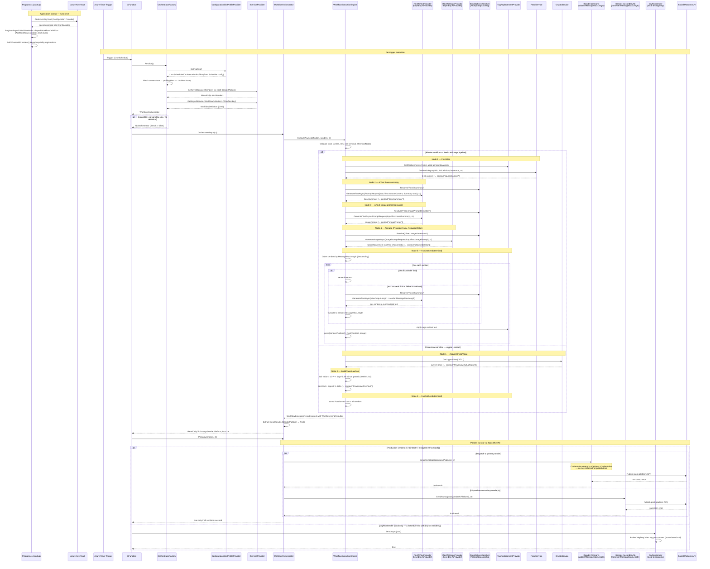

# Architecture

This document explains the architectural decisions, component responsibilities, and extension contracts of **XPoster** — an AI-powered social media automation platform built on Azure Functions.

> See also: [README.md](../README.md) for setup, configuration, and deployment instructions.

---

## Table of Contents

1. [System Overview](#1-system-overview)
2. [Component Responsibilities](#2-component-responsibilities)
3. [Design Patterns Used](#3-design-patterns-used)
4. [Architecture Decision Records (ADRs)](#4-architecture-decision-records-adrs)
5. [Extension Points](#5-extension-points)
6. [Data Flow Diagram](#6-data-flow-diagram)

---

## 1. System Overview

XPoster is a **serverless, config-driven pipeline**. Content production is defined as a **workflow DAG of nodes** (ADR-006) scheduled against UTC hours; the schedule itself lives in configuration, not code.

Six structural pillars:

- **`XFunction`** — The Azure Timer Trigger entry point (driven by `CronSchedule`); it owns no business logic. It calls `OrchestratorFactory.Resolve()`, checks `SendIt`, invokes `OrchestrateAsync()`, then dispatches via `PostAsync()`.
- **`XPosterContainerPollingFunction`** — A second timer trigger (driven by `ContainerPollingSchedule`) that polls pending Instagram media containers and publishes them once Meta reports them as ready.
- **`OrchestratorFactory`** — Maps the current UTC hour to a `ScheduledOrchestrationProfile` via an injected `ISlotProfileProvider`, resolves the slot's senders and its `WorkflowDefinition`, and constructs a `WorkflowOrchestrator` (Factory + Config-driven scheduling).
- **Workflow engine + node DAGs** — Content production is a **directed acyclic graph of nodes** registered as keyed `IWorkflowNode` services. `WorkflowExecutionEngine` runs them in topological order; the terminal node (a `FanOutSend` implementing `ITerminalNode`) produces the `SenderPlatform → Post` map. Workflows and prompt steps are declared entirely in configuration (`Workflows__*`, `PromptSteps__*`) and bound at startup.
- **Sender Plugins** — Each implements `ISender` to isolate all platform-specific API communication; dispatched in parallel via `BaseOrchestrator.PostAsync`. Adding a new platform requires zero changes to the workflow engine.
- **AI Providers** — Two capability interfaces — `ITextToTextProvider` and `ITextToImageProvider` — registered as **keyed services** by `AiProvider`. Provider selection is a **per-node** decision: `AiText`/`AiImage` nodes resolve the capability via `GetKeyedService<T>(Provider)`. A missing capability fails loudly at node execution (`InvalidOperationException`), never silently.

Sender OAuth credentials are loaded from **Azure Key Vault** at application startup via the Key Vault Configuration Provider registered in `Program.cs`. Secrets are merged into `IConfiguration` and injected into senders through `IOptions<TCredentials>` — no runtime Key Vault calls occur during post publishing. A startup `ICredentialsStartupValidator` fails fast if a credential section is missing entirely.

```
┌────────────────────────────────────────────┐
│              Azure Timer Triggers          │
│   XFunction (CronSchedule)                 │
│   XPosterContainerPollingFunction (2-min)  │
└───────────┬────────────────┬───────────────┘
            │ (main pipeline)│ (Instagram containers)
            ▼                ▼
┌─────────────────────┐   ┌───────────────────────────────────┐
│ OrchestratorFactory │   │ MetaPublishingService + BlobStorage│
│  (ISlotProfileProvider) ◄─── ConfigurationSlotProfileProvider │
└───────────┬─────────┘   └───────────────────────────────────┘
            │
            ▼
┌───────────────────────────────────────────┐
│ WorkflowOrchestrator                      │
│   → WorkflowExecutionEngine (topological) │
└───────────┬───────────────────────────────┘
            │  keyed IWorkflowNode by Type
            ▼
┌──────────────────────────────────────────────────────────────┐
│  Node DAG (configuration-declared, e.g. Bitcoin slot)        │
│   FetchRss → AiText(summary) → AiText(image prompt)          │
│           → AiImage → FanOutSend (terminal)                  │
│   PowerLaw slot: AcquireCryptoValue → BuildPowerLawPost      │
│                → FanOutSend (terminal)                       │
└───────────┬──────────────────────────────────────────────────┘
            │  Workflow.SendResults (platform → post)
            ▼
┌──────────────────────────────────────────────────────────────┐
│  BaseOrchestrator.PostAsync — parallel Task.WhenAll fan-out  │
└──┬────────┬───────────┬────────────┬──────────────┬──────────┘
   ▼        ▼           ▼            ▼              ▼
┌───────┐ ┌────────┐ ┌──────────┐ ┌─────────┐  ┌──────────────────┐
│XSender│ │InSender│ │IgSender  │ │FbSender │  │DryRunMaxLength / │
│  X    │ │LinkedIn│ │Instagram │ │Facebook │  │DryRunShortLength │
│ (250) │ │ (2800) │ │  (2200)  │ │ (3000)  │  │  (local only)    │
└───────┘ └────────┘ └──────────┘ └─────────┘  └──────────────────┘
```

**Key Vault credentials** are loaded into `IConfiguration` at application startup via the Azure Key Vault Configuration Provider (`AddAzureKeyVault` in `Program.cs`). Senders receive their credentials through standard `IOptions` binding — no Key Vault calls occur at post-publish time.

**System boundaries:**
- **Inbound**: Azure Timer Triggers (no external HTTP surface in production)
- **Outbound**: Configured AI provider APIs, Twitter/X API, LinkedIn API, Instagram & Facebook Graph API, RSS feeds, Azure Blob Storage, Azure Key Vault (startup only), cryptoprices.cc
- **Observability**: Azure Application Insights

---

## 2. Component Responsibilities

### XFunction — Entry Point

`XFunction` is the Azure Functions timer-triggered entry point (trigger: `%CronSchedule%`). Its sole responsibility is to **drive the pipeline**: call `Resolve()` on the factory to obtain the orchestrator for the current time slot, skip dispatch if `SendIt` is false, invoke `OrchestrateAsync()`, and forward the resulting dictionary of posts to `PostAsync()` for parallel fan-out dispatch. It owns no business logic, depends exclusively on injected abstractions, treats cancellation separately from unexpected errors, and re-throws unexpected exceptions so they surface in Azure Monitor.

### OrchestratorFactory — Slot Resolver

`OrchestratorFactory.Resolve()` performs the following (see `src/Orchestrator/OrchestratorFactory.cs`):

1. Reads the current UTC hour from `ITimeProvider` and calls `ISlotProfileProvider.GetProfiles()`.
2. Matches the hour to a `ScheduledOrchestrationProfile`; **every profile resolves to `WorkflowOrchestrator`**.
3. Resolves the slot's senders: for each `SenderPlatform` in the profile, `GetKeyedService<ISender>(platform)`; unresolvable platforms are skipped with a warning.
4. Resolves the workflow definition via `GetKeyedService<WorkflowDefinition>(profile.OrchestratorContextKey)`.
5. Constructs `new WorkflowOrchestrator(senders, logger, workflowEngine, definition)`.

Fallbacks (each logs a warning and returns `NoOrchestrator`): no profile matches the current hour, the slot has no `OrchestratorContextKey`, or no `WorkflowDefinition` is registered for that key. The factory **does not** resolve AI capabilities — that moved to the workflow nodes.

### ConfigurationSlotProfileProvider — Config-Driven Schedule

`ConfigurationSlotProfileProvider` is the single `ISlotProfileProvider` registered in `Program.cs`. It reads the `Schedule` configuration section (`Schedule__N__Hour`, `Schedule__N__Workflow`, `Schedule__N__Senders__M`) and produces one `ScheduledOrchestrationProfile` per entry:

| Field | Type | Purpose |
|---|---|---|
| `Hour` | `int` | Hour of day (0–23) when this slot is active |
| `SenderPlatforms` | `IReadOnlyList<SenderPlatform>` | Target platforms for this slot (unknown names are skipped with a warning) |
| `OrchestratorContextKey` | `string` | The workflow key — must match a registered `Workflows__<key>` definition |
| `OrchestratorType` | `Type` | Always `typeof(WorkflowOrchestrator)` |

Slots without a workflow key or with no valid senders are skipped with a warning. Because the schedule is configuration, **adding or changing a slot (including dry-run slots) is a configuration change only** — there is no embedded production schedule in code.

### WorkflowOrchestrator — DAG Bridge

`WorkflowOrchestrator` (extends `BaseOrchestrator`) is the only concrete orchestrator. It bridges the DAG engine to the orchestrator contract:

- **`Name`**: `"WorkflowOrchestrator"`.
- **`ProduceImage`**: **derived** from the DAG — `true` when the workflow contains an `AiImage` node. Not assignable (`NotSupportedException`).
- **`OrchestrateAsync()`**: executes the bound `WorkflowDefinition` via `IWorkflowEngine`, then extracts the `SenderPlatform → Post` map from `WorkflowContextKeys.SendResults`. On engine failure, or when the workflow completes without `SendResults`, it logs the error, sets `SendIt = false`, and returns an empty map — callers never crash.
- The orchestrator does not know about feeds, AI, or crypto: those are node concerns.

### Workflow Execution Engine

`WorkflowExecutionEngine` (`IWorkflowEngine`) executes a `WorkflowDefinition`:

- **Validation** (`WorkflowDefinitionValidator`): at registration time (throwing) and at execution time, checks for missing node references, cycles, and **exactly one** terminal node (empty `NextNodeIds`). At execution it also confirms the terminal node implements `ITerminalNode` (resolved through DI).
- **Execution**: Kahn's algorithm — nodes with in-degree 0 are enqueued, executed, and their dependents' in-degree decreased. Each node is resolved as `GetKeyedService<IWorkflowNode>(Type)`; a missing key aborts the workflow.
- **Context**: a thread-safe `WorkflowContext` (ConcurrentDictionary) carries data between nodes under `OutputKey` values. Cancellation is honoured between nodes; any failing node aborts the workflow with the node's error message.

### Node Catalogue

Every `Workflows__<Workflow>__Nodes__N__*` entry defines a node:

| Field | Type | Description |
|---|---|---|
| `Id` | string | Unique node identifier within the workflow. |
| `Type` | string | Keyed `IWorkflowNode` resolution key (registered by `AddWorkflows`). |
| `Parameters__*` | string | Node-specific parameters (provider names, input/output keys, step ids). |
| `OutputKey` | string | Context key under which the node's output is stored. |
| `NextNodeIds__N` | string | DAG edges — empty only for the terminal node. |

| `Type` | Node adapter | Parameters | Output |
|---|---|---|---|
| `FetchRss` | `FetchRssNode` | `Urls` — JSON-array string of RSS feed URLs | Concatenated feed content for a 24-hour window, pre-filtered by the tag-replacement keywords |
| `AiText` | `AiTextNode` | `Provider` (default `OpenAi`), `StepId`, `InputKey` | Generated text; throws `InvalidOperationException` if the provider has no `ITextToTextProvider` |
| `AiImage` | `AiImageNode` | `Provider`, `StepId`, `InputKey`, `Required` (default `false`) | `MediaAttachment`; missing image provider throws; a failed/empty image call is a soft-fail when `Required: false` |
| `FanOutSend` | `FanOutSendNode` | `TextKey`, `FallbackSourceKey`, `StepId`, `MediaKey` | **Terminal** — writes the `SenderPlatform → Post` map to `Workflow.SendResults` |
| `AcquireCryptoValue` | `AcquireCryptoValueNode` | `Symbol` (default `BTC`) | Current market price (decimal) |
| `BuildPowerLawPost` | `BuildPowerLawPostNode` | `Symbol`, `ActualValueKey` | Deterministic Power Law fair-value post text |

**Fan-out semantics** (`FanOutSendNode`): senders are processed in descending `MessageMaxLength` order. If the base text fits a sender's limit it is reused; otherwise the node re-summarises the `FallbackSourceKey` source with the `Feed.Summary` step capped at that sender's limit (truncating if no text provider); hashtag replacements (`ITagReplacementService`) are applied per sender. The image is shared across all senders.

### Prompt Pipeline — `PromptSteps` and Step Options

Prompt configuration is externalised to the `PromptSteps` section (`PromptSteps__<StepId>__*`), resolved at runtime by `IStepOptionsResolver`. `ConfigurationStepOptionsResolver` binds `PromptSteps:<StepId>` to a `PromptStepOptions` record (`SystemPromptTemplate`, `UserPromptTemplate`, `Temperature`, `MaxOutputLength`, `MaxTokenBudget`, `InputTextLabel`, `ImageQuantity`, `ImageSize`) and throws if the step id is missing.

There is no `PromptRole` enum anymore — an `AiText` node can target **any** step. Only `FanOutSend`'s re-summarisation reuses the summary step id (`Feed.Summary`) with a per-sender `MaxOutputLength`.

**`PromptRequest` / `ImagePromptRequest`** remain the value objects handed to providers. They are now built by the **nodes** (`AiTextNode`, `AiImageNode`, `FanOutSendNode`) from the step options plus the node's input data — providers still never own prompt-construction logic.

### BaseOrchestrator — Shared Scaffolding

`BaseOrchestrator` provides shared infrastructure for the concrete orchestrators:

- **`_senders`** (`IReadOnlyList<ISender>`): the ordered sender list for the slot.
- **`_sender`** (`ISender?`): `_senders[0]` or `null` when empty.
- **`PostAsync(posts, ct)`**: skips when `SendIt` is false; dispatches each post to the sender matching its dictionary key, in parallel via `Task.WhenAll`. A `null` post or a sender without a map entry is skipped with a warning. Returns `true` only if all dispatched senders succeed.
- **`DispatchAsync`** (private): guards null/empty content, logs a warning when `ProduceImage` is true but no image was produced, delegates to `ISender.SendAsync`, and logs `Sender {Sender} result: {Result}`.

### NoOrchestrator

A no-op slot: `SendIt = false`, `ProduceImage = false`, empty `SupportedPlatforms`, and an empty `OrchestrateAsync()` result. Returned by the factory for unscheduled hours, missing context keys, or missing workflow definitions.

### Services Layer — Shared Infrastructure

- **AiServiceHelper**: shared HTTP response parsing and HTTP 429 handling for all AI services.
- **FeedService**: RSS parser with an in-memory 24-hour TTL cache, date/keyword filtering, using the named `"Feed"` `HttpClient` behind the Polly resilience pipeline. Consumed by `FetchRssNode`.
- **CryptoService**: polls `https://cryptoprices.cc/{symbol}` for a live price; returns `0` on failure. Consumed by `AcquireCryptoValueNode`.
- **TagReplacementService**: applies the word-to-hashtag map to the final text per sender.
- **BlobStorageService**: uploads image bytes to Azure Blob Storage; returns a read-only SAS URL (backdated 5 minutes, valid 30 minutes) for the Instagram Graph API `image_url` parameter plus a blob name for later cleanup.
- **MetaPublishingService**: Instagram Graph API container creation, publishing, and status polling; used by `IgSender` and `XPosterContainerPollingFunction`.
- **IContainerStateStore / InMemoryContainerStateStore**: tracks pending Instagram containers; in-memory is fine for single-instance production (one post/day) — page the state to Table Storage for multi-instance scale.

### Providers

- **ConfigurationSlotProfileProvider** (`ISlotProfileProvider`): config-driven schedule (see above). Registered as a singleton.
- **ConfigurationTagReplacementProvider** (`ITagReplacementProvider`): reads `TagReplacementOptions:Replacements` (`TagReplacementOptions__Replacements__<word>`); case-insensitive, first occurrence only; empty/absent section is valid. Its keyword keys are also used by `FetchRssNode` to pre-filter feed items.
- **TimeProvider** (`ITimeProvider`): real UTC time.
- **LocalOverrideTimeProvider** (`ITimeProvider`): Development-only; returns the fixed UTC hour from the `ForceHour` app setting. Used only when `IsDevelopment()` and `ForceHour` is non-empty.

### HttpClientFactory — Named Clients

All outbound HTTP integrations use named clients from `HttpClientExtensions.AddHttpClients()`, each wrapped in a Polly `AddStandardResilienceHandler` pipeline (retry 3 × 2 s honouring `Retry-After`, circuit breaker 30 s break, HTTP 429/500/502/503/504 treated as retriable):

| Named Client | Consumer | Attempt / Total timeout |
|---|---|---|
| `"Feed"` | `FeedService` | 15 s / 60 s |
| `"OpenAI"` | `OpenAiService` | 30 s / 180 s |
| `"AzureFoundry"` | `AzureFoundryService` | 30 s / 180 s |
| `"DeepSeek"` | `DeepSeekService` | 30 s / 180 s |
| `"Perplexity"` | `PerplexityService` | 30 s / 180 s |
| `"FalAi"` | `FalAiImageService` | 60 s / 300 s (slower image generation) |
| `"LinkedIn"` | `InSender` | 30 s / 180 s |
| `"Instagram"` | `IgSender` | 30 s / 180 s |
| `"Facebook"` | `FbSender` | 30 s / 180 s |

> **Invariant**: every service that makes outbound HTTP calls must use a named client from this table. Creating `new HttpClient()` inline bypasses the resilience pipeline and risks socket exhaustion on Azure Functions. `XSender` is the exception — it uses the `LinqToTwitter` OAuth library and is outside this pipeline. (Note: `CryptoService` creates an untyped client via `IHttpClientFactory.CreateClient()`.)

### Sender Plugins — Platform Abstraction

Each sender implements `ISender`: `Task<bool> SendAsync(Post post, CancellationToken ct)`, `int MessageMaxLength`, `SenderPlatform Platform`. Senders are **exclusively responsible** for platform-specific serialisation and API communication; they receive a fully-formed `Post` and return a success/failure signal. Credentials arrive via `IOptions<TCredentials>` bound from Key Vault at startup.

**Current sender implementations:**

| Sender | `SenderPlatform` value | `MessageMaxLength` | Target | Notes |
|---|---|---|---|---|
| `XSender` | `X` | 250 | Twitter/X API | OAuth 1.0a via `LinqToTwitter`; 250 chars leaves room for the firm footer |
| `InSender` | `LinkedIn` | 2 800 | LinkedIn API | Direct HTTP via `IHttpClientFactory` |
| `IgSender` | `Instagram` | 2 200 | Instagram Graph API | Container flow via `MetaPublishingService` |
| `FbSender` | `Facebook` | 3 000 | Facebook Graph API | Direct HTTP via `IHttpClientFactory` |
| `DryRunMaxLengthSender` | `DryRunMaxLength` | `int.MaxValue` | **None** | Local-only; always the primary when present (widest limit) |
| `DryRunShortLengthSender` | `DryRunShortLength` | 250 | **None** | Local-only; always re-summarised against 250 chars |

`DryRunSender` (base class of the two dry-run senders) logs the post content and returns `true` without any outbound call — but first **probes configuration** for a non-empty top-level `XApiKey` and fails the run if it is missing. A dry-run is just an ordinary `Schedule` slot whose senders are dry-run platforms; there is no `EnableDryRunSlot` switching mechanism.

---

## 3. Design Patterns Used

### Factory Pattern — Time-based Orchestrator Selection

**What**: `OrchestratorFactory.Resolve()` reads the current UTC hour, asks `ISlotProfileProvider.GetProfiles()` for the schedule, matches the hour, resolves the slot's senders and its keyed `WorkflowDefinition`, and returns a fully constructed `WorkflowOrchestrator`.

**Why**: Centralising selection logic keeps time-aware conditionals out of the trigger. The factory can be unit-tested with a mock `ISlotProfileProvider`, and `ITimeProvider` makes schedule-based tests deterministic.

**Trade-off**: The schedule is now a configuration concern (see ConfigurationSlotProfileProvider). The factory itself only ever constructs `WorkflowOrchestrator` or `NoOrchestrator`.

### DAG Workflow Pattern — Content Production as Config

**What**: A `WorkflowDefinition` is a slot-scoped DAG of `WorkflowNodeDefinition`s. Nodes are keyed `IWorkflowNode` adapters resolved from DI; the engine runs them topologically; a single `ITerminalNode` (`FanOutSend`) writes the dispatch map. Workflows and prompt steps are declared in `Workflows__*` and `PromptSteps__*` configuration.

**Why**: Content algorithms become declarative. The *Bitcoin* feed pipeline (fetch → summarise → image prompt → image → fan-out), the *PowerLaw* deterministic pipeline (price → model → fan-out), and any future workflow are all configuration. The engine is orchestrator-agnostic and unit-testable.

**Trade-off**: Complex branching is awkward in a declared DAG; node adapters carry the "glue" code. Node types are compiled-in (only their wiring is config).

### Plugin Pattern — Sender Architecture

**What**: Platform senders implement a common `ISender` and are registered in the DI container as concrete types; `OrchestratorFactory` resolves them keyed by `SenderPlatform`.

**Why**: Adding a new platform requires zero changes to existing components — only a new class, a DI registration, a new `SenderPlatform` value, and a slot referencing it.

**Extensibility contract**: Any sender must:
1. Implement `ISender` (including `Platform` for dictionary-keyed routing)
2. Honour `MessageMaxLength` so `FanOutSendNode` can apply the AI re-summarisation guard correctly
3. Return `false` (not throw) on non-fatal platform errors so `PostAsync` can continue dispatching other senders

> ⚠️ **Special case — dry-run senders**: they satisfy `ISender` but are explicitly excluded from production use. They also serve as a DI scaffold that verifies the Key Vault Configuration Provider loaded secrets (via the `XApiKey` probe) before real platform credentials are put in place.

### Keyed Services Pattern — AI Capability Resolution

**What**: `ITextToTextProvider` and `ITextToImageProvider` are registered as keyed services by `AiProvider` (`AddXPosterAiProviders()` in `Program.cs`). Each workflow node (`AiText` / `AiImage`) names the provider it wants in its `Parameters__Provider` and resolves `GetKeyedService<T>(provider)` at execution time.

**Why**: Providers are capability-segregated — a text-only provider (`DeepSeek`, `Perplexity`) never implements image generation and an image-only provider (`FalAi`) never implements text. A single workflow can mix providers per node (e.g. DeepSeek for the summary `AiText`, FalAi for `AiImage`). Missing capabilities fail loudly (`InvalidOperationException` at the node) rather than silently producing degraded output.

### Value Object Pattern — Prompt Requests

**What**: `PromptRequest` and `ImagePromptRequest` are immutable `record` value objects bundling input text, templates, and tuning parameters. They are constructed by the workflow nodes from `PromptStepOptions` and passed to the provider capability methods.

**Why**: Provider interfaces stay stable regardless of prompt parameters; providers are pure translation layers. Adding a prompt parameter changes only the value object and the node that builds it.

### Config-Driven Scheduling

**What**: The orchestration schedule (`Schedule__*`), the workflow DAGs (`Workflows__*`), and prompt steps (`PromptSteps__*`) are all configuration. No code change or redeployment is needed to add a slot, change a workflow's node wiring, or swap prompt strategies.

---

## 4. Architecture Decision Records (ADRs)

Each ADR is maintained as a standalone document in [`docs/analysis/`](analysis/).

| ADR | Title | Status |
|---|---|---|
| [ADR-001](analysis/ADR-001-azure-functions-as-compute.md) | Azure Functions as Compute | Accepted |
| [ADR-002](analysis/ADR-002-strategy-pattern-generators.md) | Strategy Pattern for Content Orchestrators | Accepted |
| [ADR-003](analysis/ADR-003-plugin-pattern-senders.md) | Plugin Pattern for Senders | Accepted |
| [ADR-004](analysis/ADR-004-provider-agnostic-ai.md) | Provider-Agnostic AI Integration | Accepted |
| [ADR-005](analysis/ADR-005-capability-based-extension-points.md) | Capability-based Extension Points | Accepted |
| [ADR-006](analysis/ADR-006-workflow-based-orchestration-architecture.md) | Workflow-Based Orchestration Architecture | Accepted |

---

## 5. Extension Points

XPoster exposes four well-defined extension points. Full step-by-step instructions and code examples are in [extending-xposter.md](extending-xposter.md).

### Workflow DAGs (recommended for new content strategies)

A new content strategy is a new `Workflows__<key>` section plus any needed `PromptSteps__<StepId>` entries. Registering is automatic: `AddWorkflows` binds each section into a keyed `WorkflowDefinition` (validating the DAG at startup) and any `Schedule__N__Workflow` can reference it. For new node types, implement `IWorkflowNode` (or `ITerminalNode` for a new terminal), add a keyed registration in `AddWorkflows`, and reference it by its `Type` key.

### Platform Senders

A sender encapsulates everything needed to publish a `Post` to a social platform: authentication, serialisation, and error handling. Adding a platform requires a new class, a DI registration, a `SenderPlatform` enum value, and a slot referencing it — no changes to the engine, orchestrator, or factory.

### AI Providers

The AI layer is abstracted behind `ITextToTextProvider` / `ITextToImageProvider` keyed by `AiProvider`. Adding a provider:
1. Implement one or both capability interfaces (methods accept `PromptRequest` / `ImagePromptRequest`; do not re-interpret prompt templates).
2. Add the keyed registrations in `AddXPosterAiProviders()` in `Program.cs`.
3. Add the new `AiProvider` enum value (explicit integer to avoid renumbering).
4. Point workflow nodes at it via `Nodes__N__Parameters__Provider`.

Provider connectivity is configured under `AiProvider__*` options (`AddAiProviderOptions` binds and validates all provider sections).

### Scheduling

New slots are pure configuration: `Schedule__N__Hour` + `Schedule__N__Workflow` + `Schedule__N__Senders__M`. Hours without a slot resolve to `NoOrchestrator`.

---

## 6. Data Flow Diagram

The following sequence diagram covers end-to-end execution from Timer Trigger to post publication, including a fan-out dispatch to multiple senders. It shows the Bitcoin workflow (5-node DAG) and the PowerLaw workflow (3-node DAG) as the two currently defined strategies.

