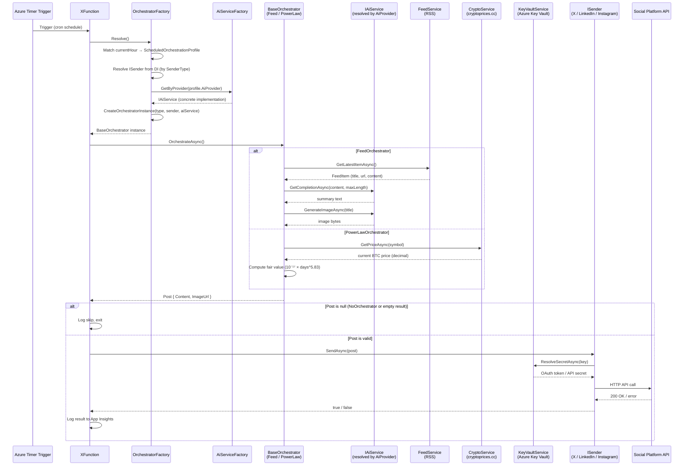

# Architecture

This document explains the architectural decisions, component responsibilities, and extension contracts of **XPoster** — an AI-powered social media automation platform built on Azure Functions.

> See also: [README.md](../README.md) for setup, configuration, and deployment instructions.

---

## Table of Contents

1. [System Overview](#1-system-overview)
2. [Component Responsibilities](#2-component-responsibilities)
3. [Design Patterns Used](#3-design-patterns-used)
4. [Architecture Decision Records (ADRs)](#4-architecture-decision-records-adrs)
5. [Extension Points](#5-extension-points)
6. [Data Flow Diagram](#6-data-flow-diagram)

---

## 1. System Overview

XPoster is a **serverless, event-driven pipeline** that runs on a timer, selects a content strategy based on the current time, generates a social media post (optionally using AI), and publishes it to one or more platforms via pluggable sender components.

```
┌────────────────────────────┐
│   Azure Timer Trigger      │
│   (configurable schedule)  │
└───────────┬────────────────┘
            │
            ▼
┌────────────────────────────┐
│   OrchestratorFactory      │ ◄─── Strategy Pattern
│   (ScheduledOrchestrationProfile list) │
└───────────┬────────────────┘
            │
    ┌───────┴────────┬──────────────┐
    ▼                ▼              ▼
┌──────────────┐   ┌──────────────┐   ┌──────────────┐
│     Feed     │   │  PowerLaw    │   │      No      │
│ Orchestrator │   │ Orchestrator │   │ Orchestrator │
└─────┬────────┘   └─────┬────────┘   └──────────────┘
      │                  │
      └──────┬───────────┘
             │
             ▼
    ┌────────────────────┐
    │   Services         │
    ├────────────────────┤
    │ • AiServiceFactory │ ◄─── Resolves IAiService by AiProvider
    │ • AiServiceHelper  │ ◄─── HTTP response parsing / 429 handling
    │ • Feed Service     │ ◄─── RSS Parser
    │ • Crypto Service   │ ◄─── CryptoPrices HTTP client
    │ • KeyVaultService  │ ◄─── Azure Key Vault secret resolution
    └────────┬───────────┘
             │
             ▼
    ┌────────────────┐
    │ Sender Plugins │
    ├────────────────┤
    │ • XSender      │ ◄─── Twitter/X API
    │ • InSender     │ ◄─── LinkedIn API
    │ • IgSender     │ ◄─── Instagram API
    └────────────────┘
```

**System boundaries:**
- **Inbound**: Azure Timer Trigger (no external HTTP surface in production)
- **Outbound**: Configured AI provider API, Twitter/X API, LinkedIn API, Instagram Graph API, RSS feeds, Azure Key Vault
- **Observability**: Azure Application Insights

---

## 2. Component Responsibilities

### XFunction — Entry Point

`XFunction` is the Azure Functions timer-triggered entry point. Its sole responsibility is to **drive the pipeline**: call `Resolve()` on the factory to obtain the correct orchestrator for the current time slot, invoke `OrchestrateAsync()`, and forward the resulting `Post` to the target sender. It owns no business logic and depends exclusively on injected abstractions, keeping the trigger layer thin and testable.

### OrchestratorFactory — Strategy Selector

`OrchestratorFactory` maps the current hour of day to a `ScheduledOrchestrationProfile` drawn from a statically declared `List<ScheduledOrchestrationProfile>`. Each profile carries four fields:

| Field | Type | Purpose |
|---|---|---|
| `Hour` | `int` | Hour of day (0–23) when this slot is active |
| `SenderType` | `MessageSender` | Identifies which `ISender` implementation to resolve |
| `OrchestratorType` | `Type` | The concrete `BaseOrchestrator` subclass to instantiate |
| `AiProvider?` | `AiProvider?` | Optional AI provider for slots that require AI services |

At runtime, the factory calls `Resolve()` to match the current hour to a profile, independently resolves the **sender** (via the DI container) and the **AI service** (via `IAiServiceFactory.GetByProvider()`), then dynamically constructs the orchestrator using reflection (`CreateOrchestratorInstance`). The effective `AiProvider` can be overridden at deploy time via the `AiProvider` configuration key, without code changes. This component is the **single point of variation** for scheduling: changing what gets posted at any hour means editing one entry in the profile list.

The factory enforces the invariant that every unscheduled hour resolves to `NoOrchestrator`, so `XFunction` never receives a null orchestrator.

### Orchestrators — Content Strategies

Each orchestrator extends `BaseOrchestrator` and encapsulates a specific **content production algorithm**:

- **FeedOrchestrator**: fetches RSS entries via `FeedService`, calls `AiService` to produce a text summary, and requests a generated image. The specific model used is determined by the resolved `IAiService` implementation. It is stateless and side-effect-free until it hands off the `Post`.
- **PowerLawOrchestrator**: constructs posts based on the Bitcoin Power Law model (`value = 10⁻¹⁷ × days^5.83`, where `days` is elapsed since the Bitcoin genesis block on 2009-01-03). It consumes `CryptoService` to fetch the live BTC price and compares it against the model's fair-value estimate. It has no dependency on `AiService`.
- **NoOrchestrator**: a null-object implementation that returns `null` immediately, allowing the factory to represent "no posting" without null-checks in `XFunction`.

### Services Layer — Shared Infrastructure

Services are registered as singletons or transients in the DI container and are consumed by orchestrators and sender plugins:

- **AiServiceFactory**: resolves the correct `IAiService` implementation by `AiProvider` enum value. Supported providers: `OpenAi`, `Perplexity`, `AzureFoundry`, `DeepSeekWithFal`. The active provider is determined per slot by the `ScheduledOrchestrationProfile` and can be overridden globally via the `AiProvider` configuration key.
- **AiServiceHelper**: a shared utility class used internally by AI service implementations (`DeepSeekService`, `FalAiImageService`, and others). It encapsulates HTTP response parsing logic and rate-limit (HTTP 429) handling, keeping individual service classes focused on their provider-specific contracts.
- **FeedService**: RSS parser with in-memory caching and deduplication; exposes a clean `IEnumerable<FeedItem>` contract.
- **CryptoService**: thin HTTP client that polls `cryptoprices.cc` to retrieve the current market price for a given cryptocurrency symbol. Returns `0` on failure to allow graceful degradation in orchestrators.
- **KeyVaultService** (`IKeyVaultService`): wraps `Azure.Security.KeyVault.Secrets` to retrieve OAuth tokens and API secrets from Azure Key Vault at runtime. Used by `XSender` and `InSender` to resolve platform credentials without storing secrets in application settings. Uses `DefaultAzureCredential`, so it transparently leverages the Function App's Managed Identity in production.

**AI Provider Services** (consumed via `IAiService` abstraction):
- **OpenAiService**: bridges `Microsoft.Extensions.AI` to the OpenAI / Azure OpenAI endpoint for both text and image generation.
- **AzureFoundryService**: bridges `Microsoft.Extensions.AI` to an Azure AI Foundry deployment.
- **DeepSeekService**: direct HTTP client to the DeepSeek API (`api.deepseek.com/v1`), OpenAI-compatible. Used standalone or as the text leg of `HybridAiService`.
- **FalAiImageService**: HTTP client to the fal.ai API for FLUX.2 Turbo image generation. Used standalone or as the image leg of `HybridAiService`.
- **HybridAiService**: composes `DeepSeekService` (text) and `FalAiImageService` (image) behind a single `IAiService` contract, enabling the `DeepSeekWithFal` provider option. It introduces no additional API surface and is the only consumer of both inner services.

### Sender Plugins — Platform Abstraction

Each sender implements `ISender`, which exposes `Task<bool> SendAsync(Post post)` and `int MessageMaxLength`. Senders are **exclusively responsible for platform-specific serialisation and API communication**; they receive a fully-formed `Post` and return a success/failure signal. This contract guarantees that orchestrators never reference platform SDKs directly.

Senders that require OAuth tokens not available in plain application settings (`XSender`, `InSender`) resolve them at runtime via `IKeyVaultService`.

---

## 3. Design Patterns Used

### Strategy Pattern — Content Orchestrators

**What**: `IOrchestrator` defines the algorithm interface; `FeedOrchestrator`, `PowerLawOrchestrator`, and `NoOrchestrator` are concrete strategies. `XFunction` programs to the interface, not the implementation.

**Why**: Content production algorithms change independently of the publishing pipeline. New strategies (e.g. a `QuoteOrchestrator` or `TrendingTopicOrchestrator`) can be introduced without touching `XFunction` or any other orchestrator. The alternative — a large `switch` block inside `XFunction` — would violate the Open/Closed Principle and make unit testing expensive.

**Trade-off**: The pattern adds one interface and one class per strategy. For the expected number of strategies (< 10), this overhead is negligible compared to the isolation gained.

### Factory Pattern — Time-based Orchestrator Selection

**What**: `OrchestratorFactory` centralises the construction and selection of `(IOrchestrator, ISender, IAiService)` triples. Its `Resolve()` method reads the current UTC hour, looks up the matching `ScheduledOrchestrationProfile`, and dynamically instantiates the orchestrator via `CreateOrchestratorInstance` (reflection-based constructor resolution), injecting the resolved sender and AI service.

**Why**: Centralising selection logic in one class avoids scattering time-aware conditionals across the codebase. Moving from a flat `Dictionary<int, MessageSender>` to a typed `ScheduledOrchestrationProfile` list makes each slot self-documenting and allows per-slot AI provider assignment without additional lookup tables. The factory can be unit-tested in isolation, and the `ITimeProvider` abstraction makes schedule-based tests deterministic.

**Trade-off**: The current implementation uses a compile-time list, so schedule changes require a code deployment. A future improvement would be externalising the schedule to Azure App Configuration, but this adds operational complexity not yet warranted.

### Plugin Pattern — Sender Architecture

**What**: Platform senders implement a common `ISender` interface and are registered in the DI container as concrete types. `OrchestratorFactory` resolves the appropriate sender from the DI container by matching the `MessageSender` enum value in the profile.

**Why**: The plugin approach means **adding a new platform requires zero changes to existing code** — only a new class, a DI registration, a new enum value, and a profile entry. This directly supports the Roadmap's expansion goals (Threads, Mastodon, BlueSky, etc.).

**Extensibility contract**: Any sender must:
1. Implement `ISender`
2. Honour `MessageMaxLength` so orchestrators can truncate content correctly
3. Return `false` (not throw) on non-fatal platform errors, allowing `XFunction` to continue

### Abstract Factory Pattern — AI Provider Resolution

**What**: `IAiServiceFactory` acts as an abstract factory that maps an `AiProvider` enum value to the concrete `IAiService` implementation registered for that provider. `OrchestratorFactory` delegates all AI service resolution to it.

**Why**: Decoupling provider selection from orchestrator construction means a new AI provider requires only a new `IAiService` implementation, a DI registration, and an `AiProvider` enum value — the factory and all orchestrators remain untouched. It also enables per-slot provider assignment (e.g. use `Perplexity` at 08:00 and `AzureFoundry` at 14:00) and a global override via configuration.

**Trade-off**: Introduces one additional indirection layer between `OrchestratorFactory` and the AI service. Acceptable given the number of supported providers (currently 4: `OpenAi`, `Perplexity`, `AzureFoundry`, `DeepSeekWithFal`).

---

## 4. Architecture Decision Records (ADRs)

Each ADR is maintained as a standalone document in [`docs/analysis/`](analysis/).

| ADR | Title | Status |
|---|---|---|
| [ADR-001](analysis/ADR-001-azure-functions-as-compute.md) | Azure Functions as Compute | Accepted |
| [ADR-002](analysis/ADR-002-strategy-pattern-generators.md) | Strategy Pattern for Content Orchestrators | Accepted |
| [ADR-003](analysis/ADR-003-plugin-pattern-senders.md) | Plugin Pattern for Senders | Accepted |
| [ADR-004](analysis/ADR-004-provider-agnostic-ai.md) | Provider-Agnostic AI Integration | Accepted |
| [ADR-005](analysis/ADR-005-capability-based-extension-points.md) | Capability-based Extension Points | **Proposed** — implementation tracked in [Issue #134](https://github.com/artcava/XPoster/issues/134) |

---

## 5. Extension Points

XPoster exposes three well-defined extension points. Each maps to a distinct abstraction in the codebase and can be implemented independently without modifying existing components. Full step-by-step instructions and code examples are in [extending-xposter.md](extending-xposter.md).

### Platform Senders

A sender encapsulates everything needed to publish a `Post` to a specific social platform: authentication, payload serialisation, and error handling. The `ISender` interface is intentionally minimal — it receives a fully-formed post and returns a boolean outcome — so platform-specific complexity is completely isolated from the rest of the pipeline.

Adding a new platform has no impact on existing senders, orchestrators, or the factory. The only touch points are a new implementing class, a DI registration, a new `MessageSender` enum value, and one entry in the scheduling profile list. This directly supports the Roadmap goal of expanding to Threads, Mastodon, BlueSky, and other platforms.

### Content Orchestrators

An orchestrator encapsulates a complete content-production algorithm: what data to fetch, how to transform it, whether to invoke an AI service, and what shape the resulting `Post` takes. Each orchestrator extends `BaseOrchestrator` and is selected at runtime based on the current time slot via `OrchestratorFactory.Resolve()`, so different algorithms can run at different hours without any conditional logic in `XFunction`.

Because orchestrators receive their dependencies (sender, AI service, data services) via constructor injection, a new orchestrator is a self-contained unit that can be developed and tested in isolation. The factory instantiates it dynamically, so no change to `OrchestratorFactory` is required beyond adding a scheduling profile entry.

### AI Providers

The AI layer is abstracted behind `IAiService`, which decouples content production logic from any specific model or vendor. The `AiProvider` enum identifies which implementation to resolve at runtime; the concrete model names, API keys, and SDK details are entirely internal to each implementation.

This design enables per-slot provider assignment (different providers can be active at different hours) and a global configuration override for A/B testing without code changes. Adding a new provider — whether a hosted API or a self-hosted model — requires only a new `IAiService` implementation, a DI registration, and an enum value. No orchestrator or scheduling logic needs to change.

---

## 6. Data Flow Diagram

The following sequence diagram covers the end-to-end execution from Timer Trigger to post publication.



---

*Document maintained by [@artcava](https://github.com/artcava) — open an issue to propose changes.*
