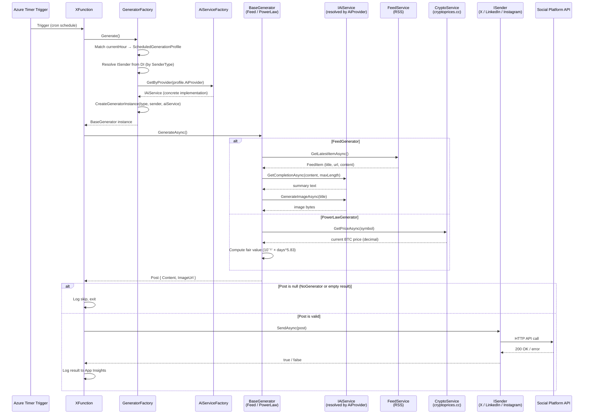

# Architecture

This document explains the architectural decisions, component responsibilities, and extension contracts of **XPoster** — an AI-powered social media automation platform built on Azure Functions.

> See also: [README.md](../README.md) for setup, configuration, and deployment instructions.

---

## Table of Contents

1. [System Overview](#1-system-overview)
2. [Component Responsibilities](#2-component-responsibilities)
3. [Design Patterns Used](#3-design-patterns-used)
4. [Architecture Decision Records (ADRs)](#4-architecture-decision-records-adrs)
5. [Extension Points](#5-extension-points)
6. [Data Flow Diagram](#6-data-flow-diagram)

---

## 1. System Overview

XPoster is a **serverless, event-driven pipeline** that runs on a timer, selects a content strategy based on the current time, generates a social media post (optionally using AI), and publishes it to one or more platforms via pluggable sender components.

```
┌────────────────────────────┐
│   Azure Timer Trigger      │
│   (configurable schedule)  │
└───────────┬────────────────┘
            │
            ▼
┌────────────────────────────┐
│   Generator Factory        │ ◄─── Strategy Pattern
│   (ScheduledGenerationProfile list) │
└───────────┬────────────────┘
            │
    ┌───────┴────────┬──────────────┐
    ▼                ▼              ▼
┌──────────┐   ┌──────────┐   ┌──────────┐
│   Feed   │   │ PowerLaw │   │    No    │
│Generator │   │Generator │   │Generator │
└─────┬────┘   └─────┬────┘   └──────────┘
      │              │
      └──────┬───────┘
             │
             ▼
    ┌────────────────────┐
    │   Services         │
    ├────────────────────┤
    │ • AiServiceFactory │ ◄─── Resolves IAiService by AiProvider
    │ • Feed Service     │ ◄─── RSS Parser
    │ • Crypto Service   │ ◄─── CryptoPrices HTTP client
    └────────┬───────────┘
             │
             ▼
    ┌────────────────┐
    │ Sender Plugins │
    ├────────────────┤
    │ • XSender      │ ◄─── Twitter/X API
    │ • InSender     │ ◄─── LinkedIn API
    │ • IgSender     │ ◄─── Instagram API
    └────────────────┘
```

**System boundaries:**
- **Inbound**: Azure Timer Trigger (no external HTTP surface in production)
- **Outbound**: Configured AI provider API, Twitter/X API, LinkedIn API, Instagram Graph API, RSS feeds
- **Observability**: Azure Application Insights

---

## 2. Component Responsibilities

### XFunction — Entry Point

`XFunction` is the Azure Functions timer-triggered entry point. Its sole responsibility is to **orchestrate the pipeline**: resolve the correct generator via the factory, call `GenerateAsync()`, and forward the resulting `Post` to the target sender. It owns no business logic and depends exclusively on injected abstractions, keeping the trigger layer thin and testable.

### GeneratorFactory — Strategy Selector

`GeneratorFactory` maps the current hour of day to a `ScheduledGenerationProfile` drawn from a statically declared `List<ScheduledGenerationProfile>`. Each profile carries four fields:

| Field | Type | Purpose |
|---|---|---|
| `Hour` | `int` | Hour of day (0–23) when this slot is active |
| `SenderType` | `MessageSender` | Identifies which `ISender` implementation to resolve |
| `GeneratorType` | `Type` | The concrete `BaseGenerator` subclass to instantiate |
| `AiProvider?` | `AiProvider?` | Optional AI provider for slots that require AI services |

At runtime, the factory resolves the matching profile, independently resolves the **sender** (via the DI container) and the **AI service** (via `IAiServiceFactory.GetByProvider()`), then dynamically constructs the generator using reflection (`CreateGeneratorInstance`). The effective `AiProvider` can be overridden at deploy time via the `AiProvider` configuration key, without code changes. This component is the **single point of variation** for scheduling: changing what gets posted at any hour means editing one entry in the profile list.

The factory enforces the invariant that every unscheduled hour resolves to `NoGenerator`, so the orchestrator never receives a null generator.

### Generators — Content Strategies

Each generator extends `BaseGenerator` and encapsulates a specific **content production algorithm**:

- **FeedGenerator**: fetches RSS entries via `FeedService`, calls `AiService` to produce a text summary, and requests a generated image. The specific model used is determined by the resolved `IAiService` implementation. It is stateless and side-effect-free until it hands off the `Post`.
- **PowerLawGenerator**: constructs posts based on the Bitcoin Power Law model (`value = 10⁻¹⁷ × days^5.83`, where `days` is elapsed since the Bitcoin genesis block on 2009-01-03). It consumes `CryptoService` to fetch the live BTC price and compares it against the model's fair-value estimate. It has no dependency on `AiService`.
- **NoGenerator**: a null-object implementation that returns `null` immediately, allowing the factory to represent "no posting" without null-checks in the orchestrator.

### Services Layer — Shared Infrastructure

Services are registered as singletons or transients in the DI container and are consumed by generators:

- **AiServiceFactory**: resolves the correct `IAiService` implementation by `AiProvider` enum value. Supported providers: `OpenAi`, `Perplexity`, `AzureFoundry`, `DeepSeekWithFal`. The active provider is determined per slot by the `ScheduledGenerationProfile` and can be overridden globally via the `AiProvider` configuration key.
- **FeedService**: RSS parser with in-memory caching and deduplication; exposes a clean `IEnumerable<FeedItem>` contract.
- **CryptoService**: thin HTTP client that polls `cryptoprices.cc` to retrieve the current market price for a given cryptocurrency symbol. Returns `0` on failure to allow graceful degradation in generators.

### Sender Plugins — Platform Abstraction

Each sender implements `ISender`, which exposes `Task<bool> SendAsync(Post post)` and `int MessageMaxLength`. Senders are **exclusively responsible for platform-specific serialisation and API communication**; they receive a fully-formed `Post` and return a success/failure signal. This contract guarantees that generators never reference platform SDKs directly.

---

## 3. Design Patterns Used

### Strategy Pattern — Content Generators

**What**: `IGenerator` defines the algorithm interface; `FeedGenerator`, `PowerLawGenerator`, and `NoGenerator` are concrete strategies. `XFunction` programs to the interface, not the implementation.

**Why**: Content generation algorithms change independently of the publishing pipeline. New generation strategies (e.g. a `QuoteGenerator` or `TrendingTopicGenerator`) can be introduced without touching the orchestrator or any other generator. The alternative — a large `switch` block inside `XFunction` — would violate the Open/Closed Principle and make unit testing expensive.

**Trade-off**: The pattern adds one interface and one class per strategy. For the expected number of strategies (< 10), this overhead is negligible compared to the isolation gained.

### Factory Pattern — Time-based Generator Selection

**What**: `GeneratorFactory` centralises the construction and selection of `(IGenerator, ISender, IAiService)` triples. It reads the current UTC hour, looks up the matching `ScheduledGenerationProfile`, and dynamically instantiates the generator via `CreateGeneratorInstance` (reflection-based constructor resolution), injecting the resolved sender and AI service.

**Why**: Centralising selection logic in one class avoids scattering time-aware conditionals across the codebase. Moving from a flat `Dictionary<int, MessageSender>` to a typed `ScheduledGenerationProfile` list makes each slot self-documenting and allows per-slot AI provider assignment without additional lookup tables. The factory can be unit-tested in isolation, and the `ITimeProvider` abstraction makes schedule-based tests deterministic.

**Trade-off**: The current implementation uses a compile-time list, so schedule changes require a code deployment. A future improvement would be externalising the schedule to Azure App Configuration, but this adds operational complexity not yet warranted.

### Plugin Pattern — Sender Architecture

**What**: Platform senders implement a common `ISender` interface and are registered in the DI container as concrete types. `GeneratorFactory` resolves the appropriate sender from the DI container by matching the `MessageSender` enum value in the profile.

**Why**: The plugin approach means **adding a new platform requires zero changes to existing code** — only a new class, a DI registration, a new enum value, and a profile entry. This directly supports the Roadmap's expansion goals (Threads, Mastodon, BlueSky, etc.).

**Extensibility contract**: Any sender must:
1. Implement `ISender`
2. Honour `MessageMaxLength` so generators can truncate content correctly
3. Return `false` (not throw) on non-fatal platform errors, allowing the orchestrator to continue

### Abstract Factory Pattern — AI Provider Resolution

**What**: `IAiServiceFactory` acts as an abstract factory that maps an `AiProvider` enum value to the concrete `IAiService` implementation registered for that provider. `GeneratorFactory` delegates all AI service resolution to it.

**Why**: Decoupling provider selection from generator construction means a new AI provider requires only a new `IAiService` implementation, a DI registration, and an `AiProvider` enum value — the factory and all generators remain untouched. It also enables per-slot provider assignment (e.g. use `Perplexity` at 08:00 and `AzureFoundry` at 14:00) and a global override via configuration.

**Trade-off**: Introduces one additional indirection layer between `GeneratorFactory` and the AI service. Acceptable given the number of supported providers (currently 4: `OpenAi`, `Perplexity`, `AzureFoundry`, `DeepSeekWithFal`).

---

## 4. Architecture Decision Records (ADRs)

### ADR-001 — Azure Functions as Compute

| Field | Detail |
|---|---|
| **Date** | 2025-Q1 |
| **Status** | Accepted |

**Context**: XPoster needs to execute a publishing workflow several times per day. The workload is bursty (seconds of CPU, then idle for hours) and has no persistent in-process state requirements.

**Decision**: Use **Azure Functions v4 (Consumption Plan)** with a Timer Trigger.

**Rationale**:
- Zero infrastructure management; scaling and availability are platform-managed.
- Cost model aligns with usage: the function executes ~8–10 times/day, well within the free tier.
- Native integration with Azure Application Insights, Key Vault, and Managed Identity.
- `.NET 8 isolated worker` model provides full control over the host process (custom middleware, DI, etc.).

**Alternatives considered**:
- **Containerised service (AKS/ACI)**: Rejected — always-on cost is unjustified for a periodic workload; adds Kubernetes or container orchestration overhead.
- **Azure Logic Apps**: Rejected — insufficient support for custom C# logic and AI SDK integration; low debuggability.
- **Azure Container Apps (scheduled jobs)**: Viable future option if cold-start latency becomes a constraint, but premature at current scale.

**Consequences**: Cold starts are possible on the Consumption Plan. Acceptable because the timer trigger fires on a fixed schedule and a delay of 1–2 seconds is not user-facing.

---

### ADR-002 — Strategy Pattern for Content Generators

| Field | Detail |
|---|---|
| **Date** | 2025-Q1 |
| **Status** | Accepted |

**Context**: The system must support multiple, independently evolving content-generation algorithms (RSS summary, Power Law model, future strategies). The orchestrator must remain stable as new algorithms are added.

**Decision**: Model each content algorithm as a class extending `BaseGenerator`, selected at runtime by `GeneratorFactory` using a `List<ScheduledGenerationProfile>`.

**Rationale**: See [Design Patterns — Strategy Pattern](#strategy-pattern--content-generators) above. Key driver: every new generator must be testable in isolation, without standing up Azure infrastructure.

**Alternatives considered**:
- **Inline conditionals in `XFunction`**: Rejected — violates SRP and OCP; every new strategy modifies the orchestrator.
- **Azure Durable Functions fan-out**: Rejected — adds orchestration complexity not needed for sequential, single-platform execution.

**Consequences**: Each generator owns its own dependencies (AI service, feed service, etc.), which are injected via `CreateGeneratorInstance`. Generator tests are pure unit tests with mocks.

---

### ADR-003 — Plugin Pattern for Senders

| Field | Detail |
|---|---|
| **Date** | 2025-Q1 |
| **Status** | Accepted |

**Context**: The system targets multiple social platforms with different APIs, rate limits, authentication schemes, and content formats. New platforms must be addable without modifying existing code.

**Decision**: Define `ISender` as the platform abstraction contract; implement one class per platform; register each in the DI container.

**Rationale**: The Roadmap explicitly targets 5+ additional platforms (Threads, Mastodon, BlueSky, YouTube Shorts, TikTok). A plugin model ensures this expansion is low-risk and reviewable in isolation.

**Alternatives considered**:
- **Single `SenderService` with platform enum**: Rejected — grows unboundedly and mixes platform-specific logic in one class.
- **External webhook/queue per platform**: Viable architectural direction for a distributed system, but over-engineered for the current single-process, low-volume deployment.

**Consequences**: Each sender is independently deployable in tests. The `MessageMaxLength` contract must be respected; violations cause silent truncation bugs at the platform layer.

---

### ADR-004 — Provider-Agnostic AI Integration

| Field | Detail |
|---|---|
| **Date** | 2026-Q1 |
| **Status** | Accepted |

**Context**: Content generation requires a large language model for summarisation and an image model for visuals. The initial implementation was coupled to a specific OpenAI model pair; as the number of supported providers and models grew, hardcoding became a maintenance liability.

**Decision**: Introduce `IAiServiceFactory` as an abstract factory that resolves `IAiService` implementations by `AiProvider` enum value (`OpenAi`, `Perplexity`, `AzureFoundry`, `DeepSeekWithFal`). The active provider per time slot is declared in `ScheduledGenerationProfile.AiProvider` and can be overridden globally via the `AiProvider` configuration key. Concrete model names are an internal concern of each `IAiService` implementation.

**Rationale**:
- `IAiService` abstraction means the underlying provider and model can be swapped without touching generators or the factory scheduling logic.
- Per-slot provider assignment (e.g. different providers at different hours) is expressed declaratively in the profile list.
- Global override via config enables A/B testing between providers without code deployments.

**Alternatives considered**:
- **Single hardcoded `AiService` (OpenAI only)**: Used in v1.x; rejected as the provider landscape expanded.
- **Hugging Face / open-source models**: Remains a valid future option via a new `IAiService` implementation; the current architecture supports it without changes.

**Consequences**: Each `IAiService` implementation manages its own SDK dependencies and model configuration. Adding a new provider requires a new class, a DI registration, and an `AiProvider` enum value — no changes to `GeneratorFactory` or any generator.

---

## 5. Extension Points

### Adding a New Platform Sender

Follow these steps; no existing file requires modification beyond steps 2–4:

**Step 1 — Implement `ISender`**

```csharp
// src/SenderPlugins/ThreadsSender.cs
public class ThreadsSender : ISender
{
    public int MessageMaxLength => 500;

    public async Task<bool> SendAsync(Post post)
    {
        // Threads API implementation
        return true;
    }
}
```

**Step 2 — Register in DI**

```csharp
// src/Program.cs
builder.Services.AddTransient<ThreadsSender>();
```

**Step 3 — Add Enum Value**

```csharp
// src/Abstraction/Enums.cs
public enum MessageSender
{
    // ...
    ThreadsSummaryFeed,
    ThreadsPowerLaw,
}
```

**Step 4 — Add a ScheduledGenerationProfile entry**

```csharp
// src/Implementation/GeneratorFactory.cs — slotProfiles list
new ScheduledGenerationProfile(20, MessageSender.ThreadsSummaryFeed, typeof(FeedGenerator), AiProvider.OpenAi),
```

The factory will resolve `ThreadsSender` automatically from the `MessageSender` enum value via the existing `switch` in `GeneratorFactory.Generate()`. Add the matching `case` there if the sender is not yet covered.

**Validation**: Write a unit test for the new sender using a mock `Post`.

---

### Adding a New Generator

**Step 1 — Extend `BaseGenerator`**

```csharp
// src/Implementation/TrendingTopicGenerator.cs
public class TrendingTopicGenerator : BaseGenerator
{
    public TrendingTopicGenerator(ISender sender, ILogger<TrendingTopicGenerator> logger, IAiService aiService)
        : base(sender, logger) { _aiService = aiService; }

    public override async Task<Post>? GenerateAsync()
    {
        var topic = await _aiService.GetCompletionAsync("Generate a trending tech topic post.", 280);
        return new Post { Content = topic };
    }
}
```

**Step 2 — Add a profile entry** referencing the new generator type:

```csharp
new ScheduledGenerationProfile(10, MessageSender.XSummaryFeed, typeof(TrendingTopicGenerator), AiProvider.Perplexity),
```

`CreateGeneratorInstance` in `GeneratorFactory` will resolve constructor parameters automatically.

**Invariant**: `GenerateAsync()` must return `null` (not throw) when no content can be produced, so the orchestrator can skip posting gracefully.

---

### Adding a New AI Provider

**Step 1 — Add the enum value**

```csharp
// src/Abstraction/AiProvider.cs
public enum AiProvider
{
    // ...
    Anthropic = 5,
}
```

**Step 2 — Implement `IAiService`**

```csharp
// src/Services/AnthropicAiService.cs
public class AnthropicAiService : IAiService
{
    // Implement GetCompletionAsync, GenerateImageAsync, etc.
}
```

**Step 3 — Register and wire in `AiServiceFactory`**

```csharp
// src/Implementation/AiServiceFactory.cs
case AiProvider.Anthropic:
    return _serviceProvider.GetRequiredService<AnthropicAiService>();
```

No changes to `GeneratorFactory`, generators, or the scheduling profile list are required.

---

## 6. Data Flow Diagram

The following sequence diagram covers the end-to-end execution from Timer Trigger to post publication.



---

*Document maintained by [@artcava](https://github.com/artcava) — open an issue to propose changes.*
